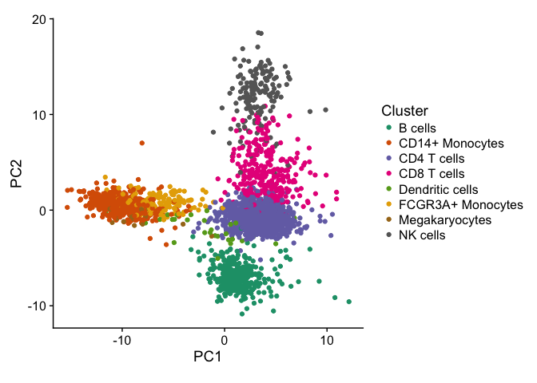
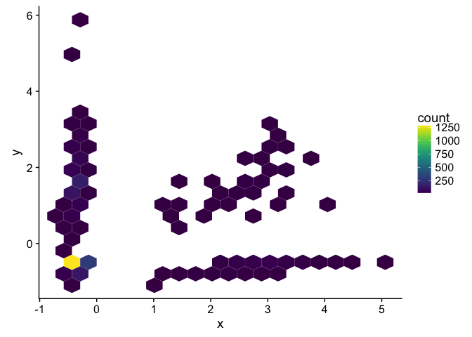
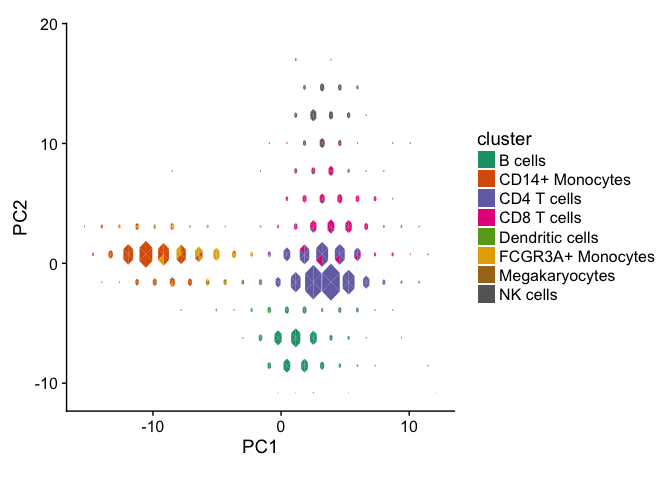
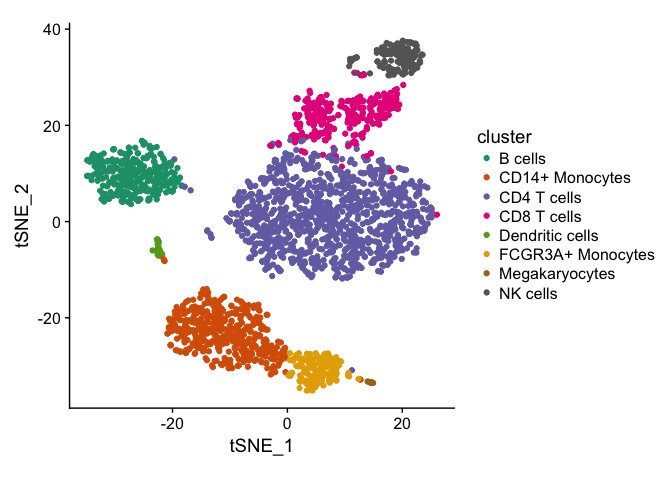
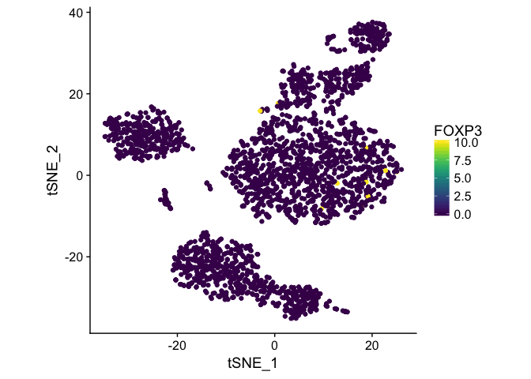
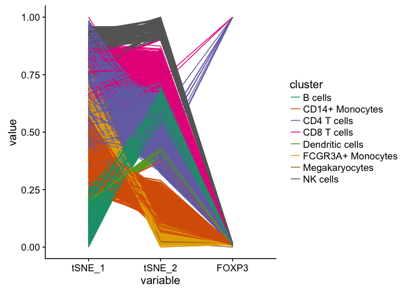
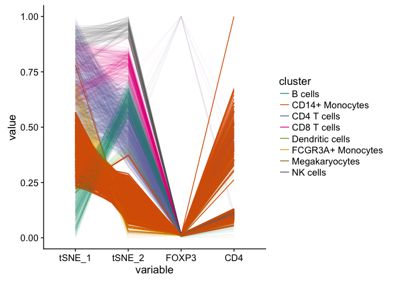
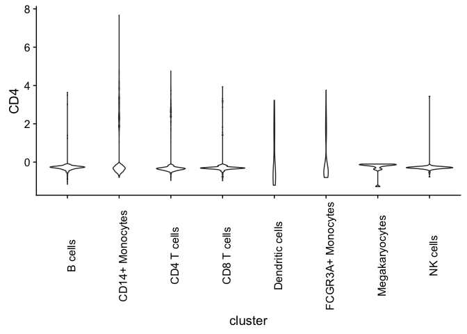
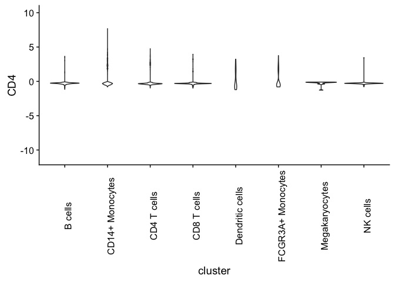

Genomic semantics for graphics
================
Stuart Lee
19/06/2018

There are many current gaps in methodology for visualising (and
performing exploratory data analysis of) high-throughput genomic
datasets. These issues relate to both the technical nature and
underlying biology of the datasets.

The current workflows of high-throughput biological data analysis
prohibit performing reproducible and interactive data visualisation for
several reasons:

1.  Most data import and processing is performed via command line
    interfaces (CLI) in batch on a high performance compute cluster. As
    a consequence, these interfaces do not enable visualisation until
    all data is processed and even if a compute environment enables a
    graphics device, the speed of rendering a graphic does not allow for
    rapid iteration. Furthermore, most current packages do not integrate
    into an exploratory or interactive workflow and are mostly used for
    creating summary graphics/reports/applications after a data analysis
    has been performed. This is not necessarily prohibitive but does
    mean the analyst only sees information that the package creator
    deems important.

2.  A lot biological data from high-througput equipment is stored in
    either binary formats or on disk formats such as HDF5 or in
    databases. Currently, in order to produce a graphic from data
    contained in these formats, they must be read into memory and then
    converted to an appropriate data structure for the graphics
    software. There are opportunities for doing this effeciently and
    quickly with R.

3.  As the number of samples grows it becomes too time consuming for an
    analyst to iterate through every sample or every possible
    combination of samples to search for problems or structure in the
    data. There is also a possibility that in such a large search space,
    the analyst may fool themselves into believing there is signal in
    their data when no such structure is present. This problem can be
    addressed with visual inference.

4.  There is a lack of visual grammar elements for biological data, in
    particular genomics. Problems include visual crowding (i.e. finding
    small width genomic ranges amongst many larger ones), plot scaling
    issues (i.e. genome-wide plots, expression plots), interactivity,
    combining multiple experiments/features.

# Introduction

Currently, Genentech has started a Single-Cell analysis working group
with the aim of forming a standardised analysis pipeline of data from
various single cell sequencing technologies. There are three areas,
where visualisation (from my reading of the situation) could play a role
at various stages of the pipeline:

1.  quality control
2.  exploratory data analysis
3.  communication of downstream pipeline outputs

The target user who would be involved with all of the above stages is a
data analyst or bioinformatician, while the target user (“end user”) for
3. is most likely a wet-lab scientist with potentially no interest in or
experience with R programming.

These users potentially require different needs: for a data analyst
being able to integrate interactive visualisations into their workflow
might be more useful than having an interface/app while for a wet-lab
scientists an interface where they can explore the results of a full
analysis. An interface for wet-lab scientists should be modular (they
can swap in/out parts of analysis they are interested in) and fast.

Other issues for visualisation of single cell data are scalability and
interoperability. Scalability comprises of two issues: the speed of
updating computations and redrawing plots on larger than memory
datasets; and visualisation issues that come with large *n*, large *p*
data including over-plotting, perceptual artefacts, slow rendering
speeds and so on. Interoperability refers the flexibility of data
structures available in packages an analyst can choose to analyse single
cell sequencing data, currently the three largest packages all use
different data structures and downstream tools for performing
differential expression analysis all use different data structures. For
packages on Bioconductor, there has been a conscientious decision to
make packages use or extend the *SingleCellExperiment* class, while
other packages such as Seurat and Monocle implement their own data
structures.

# Prior work

Most of the visualisation work for single cell RNA-seq has been focussed
on algorithms rather than interfaces or graphics. Some notable
exceptions are:

  - iSEE Bioconductor package
    (<https://www.bioconductor.org/packages/release/bioc/vignettes/iSEE/inst/doc/iSEE_vignette.html>)
    which can be used to create a shiny app for exploratory data
    analysis from a *SingleCellExperiment* object. To try it out see
    here: <http://shiny.imbei.uni-mainz.de:3838/iSEE/>. This has the
    most sophisticated interacitivity out of all the listed apps and
    implments linked brushing and selection. It is limited to only
    exploratory tasks and not necessarily for exploring the results of
    DE analysis. It seems fairly customisable. Not amazing defaults for
    plots.

  - The Broad single cell portal
    (<https://portals.broadinstitute.org/single_cell>) which provides
    some high level search functionality as a shiny app. It is very slow
    to update according to Robert.

  - Partek’s single cell explorer. I don’t know much about this one.

  - 10x’s Loupe browser. Generates fairly basic plotly tSNE plots and
    allows a user to search for the favourite gene.

The latter three software suites are closed source.

From the info vis community there has been a few efforts for modifying
t-SNE for larger datasets, in what has been called hierachical SNE
(hSNE), the relevant publications are
<https://www.nature.com/articles/s41467-017-01689-9> and
<https://cyteguide.cytosplore.org/assets/files/vis2017_hollt_cyteguide.pdf>

# Gaps

There are already a lot of tools out there for visualisation interfaces
for single cell, however there are still open research problems with the
visual representations (and efficient computation) of single cell data.
There is also no package that directly interfaces into an analyst’s
workflow for drawing interactive plots. In this regard, there is overlap
with my work with Michael on the grammar of interactive graphics. As far
as interfaces for wet-lab scientists go the iSEE package looks like a
good choice (but still requires an analyst to program it up front),
however I have yet to see the Partek interface.

# Examples

Here we use the example data in the Seurat package to demonstrate some
visualisation ideas for single cell:

``` r
# download seurat object
#download.file("https://www.dropbox.com/s/kwd3kcxkmpzqg6w/pbmc3k_final.rds?dl=1",
#              dest = "pbmc.rds")
suppressPackageStartupMessages(library(Seurat))
# override Seurat's annoying changes to global environment

# this is a Seurat object of PBMC 10x data
# used for demonstration purposes
pbmc <- readr::read_rds("pbmc.rds")

# experimental design with principal components 
pcs <- cbind(pbmc@meta.data, GetCellEmbeddings(pbmc))
```

## Addressing overplotting

A common visualisation in single cell analysis is to perform dimension
reduction (like PCA) then using a layout algorithm (like t-SNE) to plot
the dimensionally reduced form with a scatter plot. Here each point
represents a single cell and then an analyst will colour the points
according to either a categorical variable present in the experimental
design or a derived feature such as a cluster label or the value of
single gene expression.

``` r
pca_plot <- ggplot(pcs, aes(PC1, PC2, colour = ClusterNames_0.6)) + 
  geom_point() +
  scale_color_brewer("Cluster", palette = "Dark2") +
  theme(aspect.ratio = 1)
pca_plot
```

<!-- -->

Due to the number of points and the number of colours, there is visual
crowding in the plot, it’s difficult to distinguish Dendritic cells from
B cells and tell the relative number of points within each cluster. One
solution is to use transparency on the points to indicate the the
relative sizes of each cluster:

``` r
pcs <- dplyr::add_count(pcs, ClusterNames_0.6)
pca_plot2 <- ggplot(pcs, aes(PC1, PC2, colour = ClusterNames_0.6, alpha = n)) + 
  geom_point() +
  scale_color_brewer("Cluster", palette = "Dark2") +
  theme(aspect.ratio = 1)
```

It’s now clear that the largest group is Cd4 T-cells but it is now even
more difficult to distinguish between similarly coloured clusters.

Another disadvantage of the scatter plot as the number of points gets
larger is that rendering the points to the graphics device becomes
slower. Since the interest usually lies in the overall structure rather
than individual point an alternative representation is to use
hexbinning.

Here’s an example with a scatter plot for scaled expression values for
two genes within each cell.

``` r
scaled_expression <- as.data.frame(t(pbmc@scale.data[c(20, 30), ]))
names(scaled_expression) <- c("x", "y")
ggplot(scaled_expression, aes(x,y)) +
  geom_hex(bins = 20) +
  viridis::scale_fill_viridis()
```

<!-- -->

A problem with hexbinning is the colour channel in the plot is taken up
by the count within each bin, and hence no colour channel is available
for other variables. An alternative is available in the `hextri` package
by Thomas Lumley, here the hexagon is divided into triangles and for
categorical variables the relative proportions of points within a
hexagon are encoded by the colour of a triangle within a hexagon.

Here’s an example where the size of the hexagon also encodes the count:

``` r
hextri_plot <- function() {
  hex_positions <- data.frame(x = hextri_data$x, 
                              y = hextri_data$y, 
                              id = rep(seq_len(length(hextri_data$col)), 
                                       each = 4)
                              )
  
  hex_labels <- data.frame(cluster = sort(unique(pcs$ClusterNames_0.6)),
                           colour = RColorBrewer::brewer.pal(8, "Dark2"))
  hex_values <- data.frame(id = seq_len(length(hextri_data$col)),
                           colour = hextri_data$col)
  hex_values <- merge(hex_values, hex_labels, by = "colour")
  hex_df <- merge(hex_positions, hex_values, by = "id")
  
  ggplot(hex_df, aes(x, y, fill = cluster)) + geom_polygon() +
    scale_fill_brewer(palette = "Dark2") +
    theme(aspect.ratio = 1) +
    xlim(range(pcs$PC1)) + ylim(range(pcs$PC2)) +
    xlab("PC1") +
    ylab("PC2")
  
}

hextri_plot()
```

<!-- -->

Again the overall structure of the plot is similar to the original
scatter plot, we see most of the cells correspond to the CD4 T cells.
Another advantage with the hextri plot is no down sampling needs to be
performed prior to drawing the plot (as is done in Broad’s SC portal).

## Multivariate Overlays

Another common lower dimensional representation is to use the tSNE
layout algorithm:

``` r
tsne <- GetCellEmbeddings(pbmc, reduction.type = "tsne")
rownames(tsne) <- NULL
clusters <- data.frame(cluster = pbmc@meta.data$ClusterNames_0.6)
dr <- cbind(clusters, tsne)

tsne_plot <- ggplot(dr, aes(tSNE_1, tSNE_2, colour = cluster)) +
  geom_point()+
  scale_color_brewer(palette = "Dark2") +
  theme(aspect.ratio = 1)

tsne_plot
```

<!-- -->

Which solves some of the overcrowding problems mentioned above but can
no longer be interpreted like PCA (distances in tSNE space mean
nothing).

Often a user is interested in viewing a known marker gene over these
plots:

``` r
foxp3 <- grep("FOXP3", rownames(pbmc@scale.data))
foxp3_expr <- pbmc@scale.data[foxp3,]
names(foxp3_expr) <- NULL
dr <- cbind(dr, FOXP3 = foxp3_expr)

ggplot(dr, aes(tSNE_1, tSNE_2, colour = FOXP3)) +
  geom_point()+
  viridis::scale_color_viridis() +
  theme(aspect.ratio = 1)
```

<!-- -->

But how you do you visualise multiple genes at the same time while
keeping track of which cells belong to a cluster?

One possibility is a parallel coordinate plots (PCP), here each variable
is laid out on the x-axis and the values of each variable are rescaled
(so the variables are now parallel to each other). Here’s the same tsne
plot as above laid out in parallel coordinates:

``` r
GGally::ggparcoord(dr, 
                   columns = 2:4, 
                   scale = "uniminmax", groupColumn = 1) + 
  scale_color_brewer(palette = "Dark2")
```

<!-- -->

This has similar over-plotting problems as the scatter plot but they can
be overcome with interactivity (or using transparency). There’s also a
decision required in how the variables are scaled and ordered for the
plot.

Here we add in another marker gene (CD4) that is expressed on the
surface of immune cells and add in a highlight for cd14 monocytes:

``` r
cd4 <- grep("^CD4$", rownames(pbmc@scale.data))
cd4_expr <- pbmc@scale.data[cd4,]
names(cd4_expr) <- NULL
dr <- cbind(dr, CD4 = cd4_expr)
dr$is_cd14 <- grepl("CD14", dr$cluster) 
dr$alpha <- ifelse(dr$is_cd14, 1, 0.05)
GGally::ggparcoord(dr, 
                   columns = 2:5, 
                   scale = "uniminmax",
                   groupColumn = 1, 
                   alphaLines = "alpha") + 
  scale_color_brewer(palette = "Dark2") +
  guides(alpha = FALSE)
```

<!-- -->

We see that for low values of FOXP3, CD14+ monocytes have higher values
of CD4 and that there is a lot of heterogeneity within CD4 expression.
The power of parallel coordinates increases with interaction being able
to filter or exclude groups, reorder axes to see patterns and linking
parallel coordinates plots to other scatter plots is useful. PCP can
also be used to check the stability of clustering algorithms.

# Scales for expression plots

What’s an appropriate scale for expression plots?

``` r
# within the data itself
p <- ggplot(dr, aes(x = cluster, y = CD4)) + geom_violin() +
  theme(axis.text.x = element_text(angle = 90))
p
```

<!-- -->

``` r
# using a global scale accross all genes
p + ylim(range(pbmc@scale.data))
```

<!-- -->

``` r
# by moderating the scale by scaling factor for the genes expression
# using edgeR or DESeq2
```

# Interactivity

Proper interactivity entails not only having a plot that’s interactive
by itself but the ability to use a plot as a controller for other plots.
Currently there are few packages available to do this (even just having
proper linked PCPs would be beneficial).
