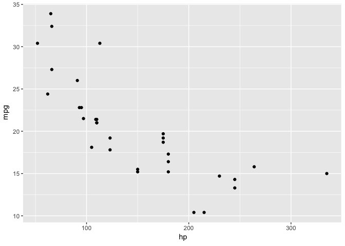
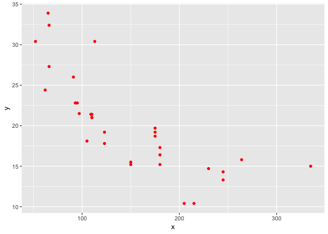
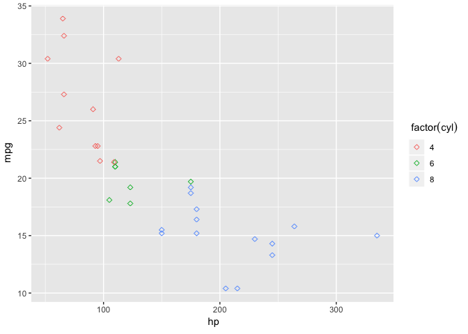

# Revisiting the grammar of graphics

The grammar of graphics is a framework that allows a user to describe
and evaluate plots in a consistent manner. As a formalism it allows a
user to discover an apporpriate plot for their given data analysis
question. Recall that the layered grammar of graphics (i.e. *ggplot2*)
defines a plot as consisting of the following features:

1.  A dataset to be plotted.
2.  A set of aesthetic mappings (aes). These determine which variables
    in a dataset correspond to graphical elements to be drawn.
3.  A set of layers. Each layer contains exactly one geometrical element
    (geoms) such as a line and exactly one statistical transformation
    (stats) like a mean or a count. A layer can also be defined with a
    dataset independent of the one used in 1.
4.  Scales for each aesthetic element. A scale defines how values of
    variables are placed on the graph with respect to their aesthetic
    mappings.
5.  A coordinate system (coords). The choice of system can modify the
    shape of a geom.
6.  A facetting (facets). Create small multiples based on subsets of the
    data. That is, the same plot is generated using different subsets of
    the data.
7.  A theme. Modify features of the graphic such as margin or text size.

In *ggplot2*, a plot object is defined as an object containing each of
the grammar elements mentioned above, with the requirement that each
layer is defined using a base R `data.frame`. The aesthetics that map to
variables in the data, forms the dataset that will be used to draw a
graphic, and then a given grammar element is computed on that data. A
clear disadvantage of this approach is that any other object type in R
must first be converted to a `data.frame` and any method for effeciently
computing on that object type is discarded when constructing a plot.

The current ggplot2 API has constructors for geoms and stats that
provide high-level conveniences, such as a geom implying a stat. For
example, `geom_bar` implies `stat_count` or `geom_histogram` implies
`stat_bin` and so on. These are convienient for the user most of the
time but can cause confusion ( i.e. using `stat_identity` to enable
rectangle heights to be proprotional to a values of a varialbe for a bar
chart). It would be better to separate convenience constructors from the
construction of the actual grammar components.

Semantically, the layering of grammar components to create a plot is
somewhat at odds with the now established fluent, pipeline-based
grammars like dplyr. Coincidentally, dplyr also provides an abstraction
that would solve some of the problems mentioned above.

## What are the potential benefits of a fluent grammar of graphics API?

Or can we make a verb based API based on the grammar of graphics and
`ggplot2` that:

1.  Can be extended to `tibbles` and other data strucutres.
2.  Provides generic code for computing grammar elements.
3.  Can be composed functionally using the pipe operator (forming the
    graphics pipeline).

## What would the verbs be for each grammar element?

In *ggplot2* a plot is constructed via a call to the `ggplot`
constructor that constructs a ggplot object. This is achieved in three
ways

1.  data with aesthetics

<!-- end list -->

    ggplot(data, aes(x = ..., y == ...))

2.  just data

<!-- end list -->

    ggplot(data)

3.  all arguments missing

<!-- end list -->

    ggplot()

The last example is generally used to add layers using different
datasets. For our API to be fluent, the constructor should be seperated
from defining the aesthetic mappings. I propose to use the verb `frame`
as the name of the generic that begins the graphics pipeline since it is
evocative of painting/drawing on a canvas (although this might not be
the best since there is a `frame()` function in base graphics.

Once a data structure has been framed, aesthetics can be added using the
*dplyr* verb `transmute` (although this feels clunky) with checks for
valid aesthetic names. Another option could be to use a preposition
function such as `with_aesthetics` so that multiple layers could be
handled. Could group wise aesthetics use `group_by` instead of having
`aes(group = )`?

Since stats are either modifiers or summaries of the input data and
transform what data is used to draw the graphic. This implies that
aggregation operations could use a `summarise` prefix and variable
transformations could use `mutate`.

The notion of `geoms` is relatively abstract, so could be replaced with
the`draw` family of functions. A question remains about what to do with
additional layers from other data sources?

The *ggplot2* `facet` and functions can already be treated as verbs.

Scales could be simplified by using a `scale_at` verb which takes
aesthetic mappings and provides a transformation function.

Coordinates could modified like aesthetics with the use of a
prepositional function or with the verb `project`.

### Examples

Here are some canonical ggplot2 examples with our API:

``` r
# scatter plot
ggplot(mtcars, aes(x = wt, y = mpg)) + geom_point()

mtcars %>% 
  frame() %>%
  with_aesthetics(x = wt, y = mpg) %>% 
  draw_points()
  
# bar chart (counting)
ggplot(mpg, aes(class))
mpg %>%
  frame() %>%
  with_aesthtics(x = class) %>%
  summarise_unique(y = n()) %>%
  draw_bar()

# bar chart with identity 
# short cut is geom_col = geom_bar(stat = "identity")
df <- data.frame(trt = c("a", "b", "c"), outcome = c(2.3, 1.9, 3.2))
ggplot(df, aes(trt, outcome)) +
  geom_col()

df %>%
  frame() %>% 
  with_aesthetics(x = trt, y = outcome) %>%
  draw_bar()
  
# histogram
ggplot(movies, aes(rating)) + geom_histogram()

movies %>%
  frame() %>% 
  with_aesthetics(x = rating) %>%
  summarise_bin(y = n()) %>%
  draw_bar() 
# histogram with sqrt scale
ggplot(movies, aes(rating)) + geom_histogram() + scale_y_sqrt()

movies %>%
  frame() %>% 
  with_aesthetics(x = rating) %>%
  summarise_bin(y = n()) %>%
  draw_bar()  %>%
  scale_at(y = "sqrt")
```

## An alternative approach: the plot is data is tibble

Another approach to writing a `dplyr` like API is to do away with
non-tabular data structures for representing a graphic altogher. Instead
we could use a tibble (or a subclass of a tibble). What would that look
like? If we look at the result of building a ggplot object - we get a
clue as to what `ggplot2` does internally before building a plot:

``` r
library(ggplot2)
# nothing to plot, but PANEL and group are intitialised
head(
  ggplot_build(ggplot(mtcars))$data[[1]]
)
```

    ##   PANEL group
    ## 1     1    -1
    ## 2     1    -1
    ## 3     1    -1
    ## 4     1    -1
    ## 5     1    -1
    ## 6     1    -1

``` r
# aesthetics are placed on the layer data
p <- ggplot(mtcars, aes(x =  hp, y = mpg))
head(
  ggplot_build(p)$data[[1]]
)
```

    ##     x    y PANEL group
    ## 1 110 21.0     1    -1
    ## 2 110 21.0     1    -1
    ## 3  93 22.8     1    -1
    ## 4 110 21.4     1    -1
    ## 5 175 18.7     1    -1
    ## 6 105 18.1     1    -1

``` r
# default aesthetic values are now propagated to the layer data
# once we call a geom
p <- p + geom_point()
head(
  ggplot_build(p)$data[[1]]
)
```

    ##     x    y PANEL group shape colour size fill alpha stroke
    ## 1 110 21.0     1    -1    19  black  1.5   NA    NA    0.5
    ## 2 110 21.0     1    -1    19  black  1.5   NA    NA    0.5
    ## 3  93 22.8     1    -1    19  black  1.5   NA    NA    0.5
    ## 4 110 21.4     1    -1    19  black  1.5   NA    NA    0.5
    ## 5 175 18.7     1    -1    19  black  1.5   NA    NA    0.5
    ## 6 105 18.1     1    -1    19  black  1.5   NA    NA    0.5

``` r
# adding in another layer with a new aesthetic 
p <- p + geom_line(aes(colour = as.factor(cyl)))

# layer 1 is the same
head(
  ggplot_build(p)$data[[1]]
)
```

    ##     x    y PANEL group shape colour size fill alpha stroke
    ## 1 110 21.0     1    -1    19  black  1.5   NA    NA    0.5
    ## 2 110 21.0     1    -1    19  black  1.5   NA    NA    0.5
    ## 3  93 22.8     1    -1    19  black  1.5   NA    NA    0.5
    ## 4 110 21.4     1    -1    19  black  1.5   NA    NA    0.5
    ## 5 175 18.7     1    -1    19  black  1.5   NA    NA    0.5
    ## 6 105 18.1     1    -1    19  black  1.5   NA    NA    0.5

``` r
# layer 2 inherits layer 1 aesthetics and adds default aesthetics for that geom
# group is now propgated
head(
  ggplot_build(p)$data[[2]]
)
```

    ##    colour  x    y PANEL group size linetype alpha
    ## 1 #F8766D 52 30.4     1     1  0.5        1    NA
    ## 2 #F8766D 62 24.4     1     1  0.5        1    NA
    ## 3 #F8766D 65 33.9     1     1  0.5        1    NA
    ## 4 #F8766D 66 32.4     1     1  0.5        1    NA
    ## 5 #F8766D 66 27.3     1     1  0.5        1    NA
    ## 6 #F8766D 91 26.0     1     1  0.5        1    NA

``` r
# adding a facet doesn't change data, instead when a plot is built
# the aes variables contained in a facet are mapped to the appropriate
# panel
p <- p + facet_wrap(~ am)
head(
  ggplot_build(p)$data[[2]]
)
```

    ##    colour   x    y PANEL group size linetype alpha
    ## 1 #F8766D  62 24.4     1     1  0.5        1    NA
    ## 2 #F8766D  95 22.8     1     1  0.5        1    NA
    ## 3 #F8766D  97 21.5     1     1  0.5        1    NA
    ## 4 #00BA38 105 18.1     1     2  0.5        1    NA
    ## 5 #00BA38 110 21.4     1     2  0.5        1    NA
    ## 6 #00BA38 123 19.2     1     2  0.5        1    NA

In principle then all the information required to build a plot could
just be stored in a tibble since that’s what’s used by *ggplot2* to
render the plot. Aesthetics are columns in a “graph” tibble with a
column representing the `geom` to be used; `stats` are transformations
of the prexisting tibble; layers could be represented via grouping or
maybe nesting of the data structures. A “graph” tibble would also have
to attibutes corresponding to variable/facet/guide labels. Facets could
potentially be represented by grouping as well but that requires more
thought. Coordinate and scale transformations appear to be computed
using the relevent layer data and need some more thinking about how they
would be represented using a “graph” tibble.

## Backend agnostic rendering

In principle, the grammar abstracts away the process of defining the
graph from the drawing of a graphic. This can be achieved via a
compile-render logic. All of the features that define a plot are
compiled into instructions that determine how the graph should be
rendered. The graphic can then actually be rendered to a graphics device
with a backend library indedpendently. The *plotly* package uses this
logic for turning a *ggplot2* object into an interactive figure.

## Implementation thus far

Here’s a rough of our grammar currently we have three functions:

  - visualise (defines what variables to plot)
  - mutate (transform the available aesthetics)
  - draw\_ (draw a graphic based on the aesthetics)

<!-- end list -->

``` r
library(easel)
library(magrittr)
p <- mtcars %>% 
  visualise(x = hp, y = mpg) %>%
  draw_points()
str(p)
```

    ## Classes 'tbl_pl', 'tbl_df', 'tbl' and 'data.frame':  32 obs. of  3 variables:
    ##  $ x   : num  110 110 93 110 175 105 245 62 95 123 ...
    ##  $ y   : num  21 21 22.8 21.4 18.7 18.1 14.3 24.4 22.8 19.2 ...
    ##  $ geom: chr  "point" "point" "point" "point" ...
    ##  - attr(*, "aes")=List of 2
    ##   ..$ x: language ~hp
    ##   .. ..- attr(*, ".Environment")=<environment: 0x7fb7ab0d15b8> 
    ##   ..$ y: language ~mpg
    ##   .. ..- attr(*, ".Environment")=<environment: 0x7fb7ab0d15b8> 
    ##   ..- attr(*, "class")= chr "quosures"

``` r
p
```

<!-- -->

``` r
p <- mtcars %>% 
  visualise(x = hp, y = mpg) %>%
  draw_points(colour = "red")

str(p)
```

    ## Classes 'tbl_pl', 'tbl_df', 'tbl' and 'data.frame':  32 obs. of  4 variables:
    ##  $ x     : num  110 110 93 110 175 105 245 62 95 123 ...
    ##  $ y     : num  21 21 22.8 21.4 18.7 18.1 14.3 24.4 22.8 19.2 ...
    ##  $ geom  : chr  "point" "point" "point" "point" ...
    ##  $ colour: chr  "red" "red" "red" "red" ...
    ##  - attr(*, "aes")=List of 2
    ##   ..$ x: language ~hp
    ##   .. ..- attr(*, ".Environment")=<environment: 0x7fb7ac1ea3f8> 
    ##   ..$ y: language ~mpg
    ##   .. ..- attr(*, ".Environment")=<environment: 0x7fb7ac1ea3f8> 
    ##   ..- attr(*, "class")= chr "quosures"

``` r
p
```

<!-- -->

``` r
p <- mtcars %>% 
  visualise(x = hp, y = mpg, colour = factor(cyl)) %>%
  draw_points(shape = 5) 

str(p)
```

    ## Classes 'tbl_pl', 'tbl_df', 'tbl' and 'data.frame':  32 obs. of  5 variables:
    ##  $ x     : num  110 110 93 110 175 105 245 62 95 123 ...
    ##  $ y     : num  21 21 22.8 21.4 18.7 18.1 14.3 24.4 22.8 19.2 ...
    ##  $ colour: Factor w/ 3 levels "4","6","8": 2 2 1 2 3 2 3 1 1 2 ...
    ##  $ geom  : chr  "point" "point" "point" "point" ...
    ##  $ shape : num  5 5 5 5 5 5 5 5 5 5 ...
    ##  - attr(*, "aes")=List of 3
    ##   ..$ x     : language ~hp
    ##   .. ..- attr(*, ".Environment")=<environment: 0x7fb7ab09ed30> 
    ##   ..$ y     : language ~mpg
    ##   .. ..- attr(*, ".Environment")=<environment: 0x7fb7ab09ed30> 
    ##   ..$ colour: language ~factor(cyl)
    ##   .. ..- attr(*, ".Environment")=<environment: 0x7fb7ab09ed30> 
    ##   ..- attr(*, "class")= chr "quosures"

``` r
p
```

<!-- -->
